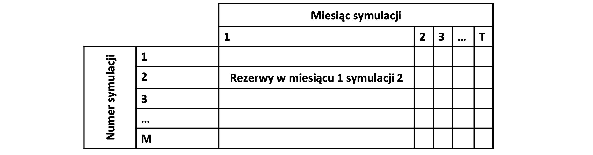
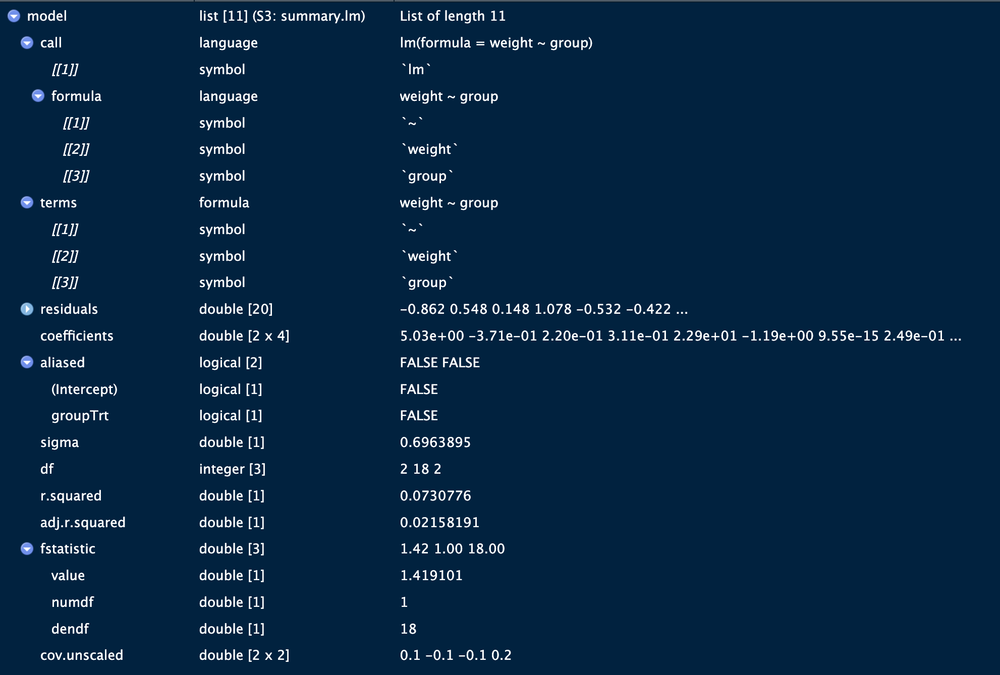
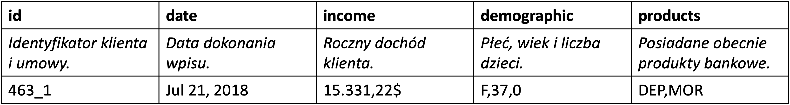
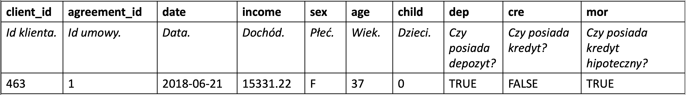

```{r, echo=FALSE}
pdf.options(encoding='ISOLatin2')
```

# Zadanie 1

Proszę dla kredytu hipotecznego z ratą stałą udzielonego na kwotę $K$,
przy rocznej stopie oprocentowania$~r$  zaciągniętego na okres \( n \) miesięcy wyznaczyć:

1. Wysokość oprocentowania miesięcznego: $q = 1 + \frac{r}{12}$

2. Wysokość raty miesięcznej: $R = K \cdot q^n \cdot \frac{q - 1}{q^n - 1}$

3. Całkowitą kwotę do spłaty:  $F = R \cdot n$

```{r}
# Wartości nie są przypadkowe
K <- 340124.79
r <- 7.46/100
n <- 274

q <- 1 + (r / 12)
R <- K * q**n * ((q - 1) / (q**n - 1))
F <- R * n
```
Ad. 1. Wysokość miesięcznego oprocentowania: $q =$ `r format(q, big.mark = ",")` %

Ad. 2. Rata miesięczna: $R$ = `r format(round(R, 2), big.mark = ",", nsmall = 2)` PLN

Ad. 3. Całkowita kwota do spłaty: $F =$ `r format(round(F, 2), big.mark = ",", nsmall = 2)` PLN

***

# Zadanie 2

Proszę dla kredytu hipotecznego z ratą malejącą udzielonego na kwotę $K$,
przy rocznej stopie oprocentowania\(~r\), zaciągniętego na okres $n$
miesięcy wyznaczyć:

1. wysokość części kapitałowej raty $R_0 = \frac{K}{n}$,

2. wysokość części odsetkowej raty i-tej $R_1^i = \frac{(K - (i - 1) \cdot R_0) \cdot r}{12}$,

3. wysokość raty i-tej $R^i = R_0 + R_1^i$,

4. całkowitą kwotę do spłaty $F = \sum_{i=1}^{n} R^i$.

Jaka była najniższa, średnia i najwyższa wartość raty?

```{r}
R_0 <- K / n
iter <- seq(1, n)
R_1 <- ((K - (iter - 1) * R_0) * r) / 12
R_i <- R_0 + R_1
F_2 <- sum(R_i)
```

Ad. 1. Wysokość części kapitałowej raty: $R_0 =$
`r format(round(R_0, 2), big.mark = ",", nsmall = c(2))` PLN

Ad. 2. i 3. Wysokość części odsetkowej raty $R_1^i$ i raty całkowitej $R_i$:

```{r, echo=FALSE, results='asis'}
df <- data.frame(row = iter, interest = R_1, rata = R_i)
head_rows <- df[1:3, ]
tail_rows <- df[(nrow(df)-2):nrow(df), ]
string <- c()
string <- c(string, as.array("| i | Wysokość części odsedkowej | Wysokość raty |"))
string <- c(string, as.array("|:-:|:--------------------------:|:-------------:|"))
string <- c(string, as.array(
    apply(head_rows, 1, function(x) 
               sprintf("| %g | %s PLN | %s PLN |", 
                       x["row"], 
                       format(round(x["interest"], 2), 
                              big.mark = ",", 
                              nsmall = 2),
                        format(round(x["rata"], 2), 
                              big.mark = ",", 
                              nsmall = 2)))))
string <- c(string, as.array("| ... |  ...  |  ...  |"))
string <- c(string, as.array(
    apply(tail_rows, 1, function(x) 
              sprintf("| %g | %s PLN | %s PLN |", 
                      x["row"], 
                      format(round(x["interest"], 2), 
                             big.mark = ",", 
                             nsmall = 2),
                      format(round(x["rata"], 2), 
                             big.mark = ",", 
                             nsmall = 2)))))
cat(string, sep = "\n")
```
Ad. 4. Całkowita kwota do spłaty: $F =$ `r format(round(F_2, 2), big.mark = ",", nsmall = 2)` PLN

Wysokość najniższej/średniej/najwyższej raty: (
`r format(round(min(R_i),  2), big.mark = ",", nsmall = 2)` /
`r format(round(mean(R_i), 2), big.mark = ",", nsmall = 2)` /
`r format(round(max(R_i),  2), big.mark = ",", nsmall = 2)`
) PLN

***

# Zadanie 3

W pliku `wig_changes.rds` znajduje się wektor uporządkowanych chronologicznie
wartości tekstowych \newline `+` oraz `-`, reprezentujących dni, w których:

- \( (+) \) wartość indeksu WIG wzrosła względem wartości z dnia poprzedniego,
- \( (-) \) wartość indeksu WIG zmalała względem wartości z dnia poprzedniego.

Bazując na tym wektorze wyznacz następującą macierz:

\begin{table}[h!]
\centering
\scriptsize
\begin{tabular}{c|c|c}
\toprule
\( \text{t-1} \backslash \text{t} \) & \( + \) & \( - \) \\
\midrule
\( + \) & Prawdopodobieństwo wystąpienia stanu \( + \) po stanie \( + \) & Prawdopodobieństwo wystąpienia stanu \( - \) po stanie \( + \) \\
\( - \) & Prawdopodobieństwo wystąpienia stanu \( + \) po stanie \( - \) & Prawdopodobieństwo wystąpienia stanu \( - \) po stanie \( - \) \\
\bottomrule
\end{tabular}
\end{table}

Podnieś utworzoną macierz do potęgi \( 3 \).

```{r}
wig_changes <- readRDS('wig_changes.rds')
factors <- factor(wig_changes, levels = c("+", "-"))
from <- head(factors, -1)
to   <- tail(factors, -1)
# factors: c(- + - - + + - +)
# from:    c(- + - - + + -)
# to:      c(+ - - + + - +)
# Stwórz tabelę wszystkich możliwych przejść z `from` do `to`
trans_matrix <- table(from, to)
# proportions() przekształca tablicę liczebności w tablicę prawdopodobieństw
# margin = 1 - liczebności są zamieniane w prawdopodobieństwa względem _wierszy_.
# Tworzymy w ten sposób Macierz przejść Markowa
# (https://www.stat.auckland.ac.nz/~fewster/325/notes/ch8.pdf)
trans_prob <- proportions(trans_matrix, margin = 1)
trans_prob_txt <- capture.output(show(trans_prob))

trans_prob_3 <- trans_prob**3
trans_prob_3_txt <- capture.output(show(trans_prob_3))

result <- paste0("Macierz prawdopodobieństwa przejść:\n",
                    paste(trans_prob_txt, collapse = "\n"), "\n\n",
                 "Macierz prawdopodobieństwa do potęgi 3:\n",
                    paste(trans_prob_3_txt, collapse = "\n"))
cat(result)
```

***

# Zadanie 4a

W ramach pewnego ubezpieczenia $N$ klientów płaci składkę wysokości $K$
w zamian za możliwość uzyskania kwoty $F$ jeżeli nastąpi zdarzenie. Zbuduj
symulację tego ubezpieczenia na okres $T$ miesięcy zgodnie z poniższym algorytmem.

1. Przyjmij $t = 1$.

2. Wyznacz rezerwę na wypłaty:  $S_t = \begin{cases} KN, & t = 1 \\ S_{t-1} + KN, & t > 1 \end{cases}$

3. Wyznacz liczbę wypłat: $a = \#\{n: c_n \geq F^{-1}_{t(2)}(0.9999)\}, \quad c_n \sim t(2)$.

4. Wypłać odszkodowania: $S_t = S_t - aF$

5. Sprawdź płynność: $S_t \geq 0$

   1. Jeżeli spełnione, to zmodyfikuj liczbę ubezpieczonych: $N = N + n - o - a$,
   gdzie $n$ to losowa liczba z przedziału od 0 do 100 nowych klientów,  a $o$
   to losowa liczba z przedziału od 0 do 90 klientów rezygnujących.

   2. Jeżeli nie spełnione, to firma zbankrutowała. Zatrzymaj algorytm przed czasem.

6. Przyjmij $t = t + 1$.

7. Jeżeli $t \leq T$, to przejdź do kroku 2, w przeciwnym przypadku: **KONIEC**.

```{r}
N <- 1000 # Liczba klientów
K <- 100 # Wysokość składki
F <- 200000 # Wysokość ubezpieczenia
T <- 100 # Symulacja na T miesięcy

t <- 1
s_t <- 0
log_df <- data.frame(
  t = integer(),
  N = integer(),
  S = numeric(),
  a = integer(),
  stringsAsFactors = FALSE
)

while (t <= T) {
    s_t <- s_t + K * N
    # Wygeneruj rozkład t-Studenta ze stopniem swobody = 2
    c_n <- rt(N, df = 2)
    # Kwantyl 0.9999 rozkładu t-Studenta
    th <- qt(0.9999, df = 2)
    a <- sum(c_n >= th)
    # Wypłata odszkodowań
    s_t <- s_t - a * F
    # Zapis stanu do tabeli
    log_df <- rbind(log_df, data.frame(t = t, N = N, S = s_t, a = a))
    
    if (s_t >= 0) {
        # Losowa liczba nowych klientów z przecdziału 0-100
        n <- sample(seq(0, 100), 1)
        # Losowa liczba rezygnujących klientów z przedziału 0-90
        o <- sample(seq(0, 90), 1)
        # Liczba likentów na następny okres (miesiąc)
        # Warto zauważyć, że odliczamy tych, którym firma
        # wypłaciła odszkodowanie.
        N <- N + n - o - a
    } else {
        # Firma zbankrutowała *KONIEC*
        break
    }
    t <- t + 1
}
```

***

# Zadanie 4b

Wykonaj następujące czynności.

1. Stwórz funkcję przeprowadzającą zaprojektowaną symulację
    1. o argumentach $K, N, F, T$ z wartościami domyślnymi,
    2. zwracającą wektor $S_t$ długości $T$ jako wynik. Jeżeli firma
    zbankrutowała, w wektorze powinny od tego momentu znajdować się wartości `NA`.

2. Napisz kod wykonujący symulację ubezpieczenia $M$ razy i zapisujący wyniki
   do macierzy `SIM` postaci:

```{r, echo = FALSE}

```

3. Bazując na macierzy `SIM`, odpowiedz na poniższe pytania.
    1. Jakie jest prawdopodobieństwo tego, że spółka nie zbankrutuje do chwili $t = 1, 2, \dots, T$?
    2. Jaki średni poziom rezerw będzie miała spółka pod warunkiem, że nie zbankrutuje do chwili $t = 1, 2, \dots, T$?
    3. Jaki jest oczekiwany okres życia spółki przy założeniu, że maksymalny czas jej życia wynosi $T$?

```{r}
N <- 1600 # Liczba klientów
K <- 100 # Wysokość składki
F <- 500000 # Wysokość ubezpieczenia
T <- 100 # Symulacja na T miesięcy
M <- 50 # Liczba symulacji

t <- 1
s_t <- 0

fn.simulate <- function(M) { 
    t <- 1
    s_t <- 0
    row <- rep(NA, T)
    while (t <= T) {
        s_t <- s_t + K * N
        c_n <- rt(N, df = 2)
        th <- qt(0.9999, df = 2)
        a <- sum(c_n >= th)
        s_t <- s_t - a * F
        
        if (s_t >= 0) {
            n <- sample(seq(0, 100), 1)
            o <- sample(seq(0, 90), 1)
            N <- N + n - o - a
        } else {
            # Bankrut!
            # cat("Firma zbanrutowała w miesiącu (", t, "), przy (", a,") zdarzeniach.\n")
            break
        }
        row[t] <- s_t
        t <- t + 1
    }
    return(row)
}

symulacja <- lapply(seq(1:M), FUN = fn.simulate)
symulacja_mat <- do.call(rbind, symulacja)
rownames(symulacja_mat) <- paste0("Sym_", seq(1:M) )
colnames(symulacja_mat) <- paste0("Miesiac_", seq(1:T) )
knitr::kable(symulacja_mat[, 1:7],  booktabs = FALSE, row.names = TRUE)

prawd_istnienia <- 100 - (100 * colSums(is.na(symulacja_mat)) / M)

srednie_rezerwy <- colMeans(symulacja_mat, na.rm = TRUE) 

czas_zycia <- apply(symulacja_mat, 1, function(x) {
  first_na <- which(is.na(x))[1]
  if (is.na(first_na)) {
    return(ncol(symulacja_mat))  # przeżyła do końca
  } else {
    return(first_na - 1)  # bankructwo w miesiącu `first_na`
  }
})

oczekiwany_czas_zycia <- mean(czas_zycia)
```

```{r, echo=FALSE, results='asis'}
df <- data.frame(
    miesiac = seq(1:T),
    prawdopodobienstwo_istnienia = prawd_istnienia,
    srednie_rezerwy = round(srednie_rezerwy, digits = 0)
)
head_rows <- df[1:15, ]
tail_rows <- df[(nrow(df)-14):nrow(df), ]

dots_row <- as.data.frame(matrix("...", nrow = 1, ncol = ncol(df)))
colnames(dots_row) <- colnames(df)

df_short <- rbind(head_rows, dots_row, tail_rows)

colnames(df_short) <- c("Miesiąc życia", "Prawdopodobieństwo istnienia (w %)", "Średnie rezerwy")
knitr::kable(df_short, booktabs = TRUE, row.names = FALSE)
```

Oczekiwany okres życia spółki wynosi `r oczekiwany_czas_zycia` miesięcy.

***

# Zadanie 5
Plik `age.rds` zawiera dane dotyczące wieku klientów pewnego banku. Przeanalizuj te dane pod kątem odpowiedzi na następujące pytania.

1. Jaki wiek ma najmłodszy i najstarszy klient?

2. Jaki jest przeciętny wiek klientów banku?

3. Jak bardzo zróżnicowani są klienci banku pod względem wieku?

4. Ilu klientów banku jest niepełnoletnich? Jaki to procent całości?

5. Ilu klientów banku jest w wieku 30–50 lat? Jaki to procent całości?

6. Ilu klientów nie podało swojego wieku? Jaki to procent całości?

7. Ile klientów bank posiada w segmentach wiekowych  \([16,17]\), \([18,24]\),
    \([25,34]\), \([35,44]\), \([45,64]\), \([65,\infty)\)?
   Jaki to procent całości?
   
```{r}
df <- readRDS("age.rds")
age <- na.omit(df)
najmlodszy <- min(age)
najstarszy <- max(age)
przecietny <- mean(age)
odchylenie <- sd(age)
rozstep <- IQR(age)

niepelnoletni <- sum(age < 18)
niepelnoletni_p <- 100 * niepelnoletni / length(age)
niepelnoletni_pa <- 100 * niepelnoletni / length(df)
klienci_30_50 <- sum(age >= 30 & age < 51)
klienci_30_50_p <- 100 * klienci_30_50 / length(age)
klienci_30_50_pa <- 100 * klienci_30_50 / length(df)
klienci_na <- length(df) - length(age)
klienci_na_p <- 100 * klienci_na / length(df)

przedzialy <- c(16, 18, 25, 35, 45, 65, Inf)
# Dla liczb całkowitych przedział [16, 17] jest tożsamy z [16, 18) 
#                        podobnie [18, 24] jest tożsamy z [18, 25)
tablica <- table(cut(age, breaks = przedzialy, include.lowest = TRUE, right = FALSE))
tablicaA <- 100 * proportions(tablica)
tablicaB <- 100 * tablica / length(df)
```
Ad. 1. Najmłodszy klient ma `r najmlodszy` lat, najstarszy `r najstarszy`.

Ad. 2. Przeciętny wiek klienta banku wynosi `r przecietny` (średnia wieku).

Ad. 3. Odchylenie standardowe wynosi `r odchylenie` a rozstęp międzykwartylowy 
(IQR) wynosi `r rozstep`.

Ad. 4. Klientów niepełnoletnich jest `r niepelnoletni`, co stanowi `r niepelnoletni_pa` %
wszystkich klientów oraz `r niepelnoletni_p` % klientów, którzy podali wiek.

Ad. 5. Klientów w wieku 30-50 lat jest `r klienci_30_50`, co stanowi `r klienci_30_50_pa` %
wszystkich klientów, oraz `r klienci_30_50_p` % klientów, którzy podali wiek.

Ad. 6. Wieku nie podało `r klienci_na` klientów, co stanowi `r klienci_na_p` % wszystkich
klientów.

Ad. 7. W segmentach wiekowych $[16,17]$, $[18,24]$, $[25,34]$, $[35,44]$, 
$[45,64]$, $[65,\infty)$, które dla wieku są tożsame z segmentami prawostronnie
otwartymi  $[16,18)$  $[18,25)$  $[25,35)$  $[35,45)$  $[45,65)$ $[65,\infty]$ liczba
klientów wynosi odpowiednio:
```{r, echo = FALSE}
print(tablica)
```

Procentowo względem klientów, którzy podali wiek:
```{r, echo = FALSE}
print(tablicaA, digits = 2)
```

Procentowo względem wszystkich klientów banku:
```{r, echo = FALSE}
print(tablicaB)
```

***

# Zadanie 6
Wykonanie poniższego kodu spowoduje skonstruowanie prostego modelu liniowego
zapisanego w postaci listy w obiekcie model. Wykonaj ten kod, a następnie:

1. przyjrzyj się strukturze obiektu model,

2. znajdź i wyświetl współczynniki modelu (`coefficients`),

3. znajdź i wyświetl wartości resztowe modelu (`residuals`),

4. znajdź i wyświetl wartość dopasowanego $R^2$ (`adj.r.squared`).

```{r}
c(4.17,5.58,5.18,6.11,4.50,4.61,5.17,4.53,5.33,5.14) -> ctl
c(4.81,4.17,4.41,3.59,5.87,3.83,6.03,4.89,4.32,4.69) -> trt
gl(2, 10, 20, labels = c("Ctl","Trt")) -> group
c(ctl, trt) -> weight
summary(lm(weight ~ group)) -> model
```

### Ad. 1. przyjrzyj się strukturze obiektu model

```{r}

```

### Ad. 2. znajdź i wyświetl współczynniki modelu (`coefficients`) 
```{r}
model$coefficients
```

### Ad. 3. znajdź i wyświetl wartości resztowe modelu (`residuals`) 
```{r}
model$residuals
```


### Ad. 4. znajdź i wyświetl wartość dopasowanego $R^2$ (`adj.r.squared`) 
```{r}
model$adj.r.squared
```


***

# Zadanie 7
Załaduj plik `ugly_diamonds.csv` do R w postaci poprawnej ramki danych, tzn.
ramki danych która spełnia poniższą specyfikację:
```
'data.frame':10 obs. of 10 variables:
$ carat : num 0.23 0.21 0.23 0.29 0.31 0.24 0.24 0.26 0.22 0.23
$ cut : chr "Ideal" "Premium" "Good" "Premium" ...
$ color : chr "E" "E" "E" "I" ...
$ clarity: chr "SI2" "SI1" "VS1" "VS2" ...
$ depth : num 61.5 59.8 56.9 62.4 NA 62.8 62.3 61.9 65.1 59.4
$ table : int 55 61 65 58 58 57 57 55 61 61
$ price : int 326 326 327 334 335 336 336 337 337 338
$ x : num 3.95 3.89 4.05 4.2 4.34 3.94 3.95 4.07 3.87 4
$ y : num 3.98 3.84 4.07 4.23 4.35 3.96 3.98 4.11 3.78 4.05
$ z : num 2.43 2.31 2.31 2.63 2.75 2.48 2.47 2.53 2.49 2.39
```

```{r}
diamonds <- read.csv("ugly_diamonds.csv", header = TRUE, sep = "%", skip = 4)

fn.convert_comma <- function(M) {
  M <- gsub(",", ".", M, fixed = TRUE)
  as.numeric(M)
}

cols_to_fix <- c("carat", "depth", "price", "x", "y", "z")
diamonds[cols_to_fix] <- lapply(diamonds[cols_to_fix], fn.convert_comma)

diamonds$price <- as.integer(diamonds$price)

str(diamonds)
```

***

# Zadanie 8
Plik `bank_register.rds` zawiera dane dotyczące klientów pewnego banku w postaci następującej struktury.

```{r, echo = FALSE}

```

Przekształć te dane do poniższej postaci.

```{r, echo = FALSE}

```

```{r}
bank_register <- readRDS("bank_register.rds")

frame <- data.frame(
    date = as.Date(bank_register$date, format = "%b %d, %Y")
)
frame[c("client_id", "agreement_id")] <- do.call(rbind, 
                                                 strsplit(bank_register$id, '_' ))
frame[c("sex", "age", "child")] <- do.call(rbind, 
                                           strsplit(bank_register$demographic, ',' ))

frame$income <- as.numeric(gsub(",", ".", 
                                gsub("\\.", "", 
                                     gsub("\\$", "", bank_register$income))))

frame$mor <- grepl("MOR", bank_register$products, ignore.case = TRUE)
frame$dep <- grepl("DEP", bank_register$products, ignore.case = TRUE)
frame$cre <- grepl("CRE", bank_register$products, ignore.case = TRUE)

columns <- c("client_id", "agreement_id", "date", "income", 
             "sex", "age", "child", "dep", "cre", "mor")
output <- frame[1:10, columns]

# Tabela wejściowa - dziesięć pierwszych rzędów
knitr::kable(bank_register[1:10, ], booktabs = TRUE, row.names = TRUE)

# Tabela wyjściowa - dziesięć pierwszych rzędów
knitr::kable(output[1:10, ], booktabs = TRUE, row.names = )
```

***

# Zadanie 9
Plik `albums.csv` zawiera następujące dane dotyczące albumów muzycznych:

- `artist_id` – identyfikator artysty,
- `album_title` – tytuł albumu,
- `genre` – gatunek muzyczny,
- `year_of_pub` – rok publikacji,
- `num_of_tracks` – liczba piosenek na płycie,
- `num_of_sales` – liczba sprzedanych płyt,
- `rolling_stone_critic` – ocena Rolling Stone Magazine,
- `mtv_critic` – ocena MTV,
- `music_maniac_critic` – ocena Music Maniac.

Bazując na zdobytej dotychczas wiedzy przeprowadź prostą analizę tej próbki.

```{r}

suppressPackageStartupMessages(library(dplyr))
suppressPackageStartupMessages(library(ggplot2))

# Wczytywanie danych
albums <- read.csv("albums.csv")

# Najlepiej sprzedające się albumy
top_sold_albums <- albums %>%
    group_by(artist_id, album_title) %>%
    reframe(artist_id, album_title, genre, year_of_pub, num_of_sales) %>%
    arrange(desc(num_of_sales))
knitr::kable(top_sold_albums[1:10, ], booktabs = TRUE, 
             row.names = TRUE, caption = "Najlepiej sprzedające się albumy")

# Top 10 gatunków muzycznych wg sprzedaży
top_genres_by_sales <- albums %>% 
    group_by(genre) %>% 
    summarise(total_sales = sum(num_of_sales)) %>% 
    arrange(desc(total_sales))
knitr::kable(top_genres_by_sales[1:10, ], booktabs = TRUE, 
             row.names = TRUE, caption = "Top 10 gatunków wg sprzedaży")

# Top 10 gatunków muzycznych wg ilości albumów
top_genres_by_number <- albums %>% 
    group_by(genre) %>% 
    summarise(total_albums = n()) %>% 
    arrange(desc(total_albums))
knitr::kable(top_genres_by_number[1:10, ], booktabs = TRUE, 
             row.names = TRUE, caption = "Top 10 gatunków wg ilości albumów")

# Top 10 tytułów albumów
top_album_names <- albums %>%
    group_by(album_title) %>%
    summarize(album_count = n()) %>%
    arrange(desc(album_count))
knitr::kable(top_album_names[1:10, ], booktabs = TRUE,
             row.names = TRUE, caption = "Top 10 tytułów albumów muzycznych")

# Najbardziej płodni artyści
top_artists <- albums %>%
    group_by(artist_id) %>%
    summarize(sum_tracks = sum(num_of_tracks), sum_albums = n(), sum_sales = sum(num_of_sales))

# - po ilości sprzedanych płyt
top_artists %>%
    arrange(desc(sum_sales)) %>%
    reframe(artist_id = artist_id, sum_sales = sum_sales) %>%
    head(10) %>%
    knitr::kable(booktabs = TRUE, row.names = TRUE,
                 caption = "Najlepiej sprzedający się artyści")

# - po ilości wydanych albumów 
top_artists %>%
    arrange(desc(sum_albums)) %>%
    reframe(artist_id = artist_id, sum_albums = sum_albums) %>%
    head(10) %>%
    knitr::kable(booktabs = TRUE, row.names = TRUE,
                 caption = "Artyści, którzy wydali najwięcej płyt")

# Szukamy korelacji między polami w tabeli
korelacja <- cor(albums[, c("num_of_sales", "rolling_stone_critic", "mtv_critic", "music_maniac_critic")])
knitr::kable(korelacja)

```
Próbka zawiera `r count(albums)` albumów `r length(unique(albums$artist_id))` artystów
wydanych od `r min(albums$year_of_pub)` do `r max(albums$year_of_pub)` roku w `r length(unique(albums$genre))`
gatunkach.

Macież korelacji nie wykazała liniowych zależności ani pomiędzy ocenami a ilością
sprzedanych płyt, ani między samymi ocenami.

Dane wyglądają na wygenerowane losowo.

***