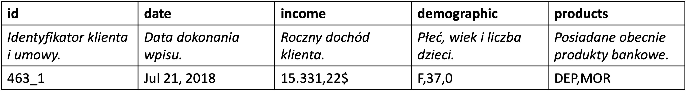

```{r, echo=FALSE}
pdf.options(encoding='ISOLatin2')
```

# Zadanie 1

Proszę dla kredytu hipotecznego z ratą stałą udzielonego na kwotę $K$,
przy rocznej stopie oprocentowania$~r$  zaciągniętego na okres \( n \) miesięcy wyznaczyć:

1. Wysokość oprocentowania miesięcznego: $q = 1 + \frac{r}{12}$

2. Wysokość raty miesięcznej: $R = K \cdot q^n \cdot \frac{q - 1}{q^n - 1}$

3. Całkowitą kwotę do spłaty:  $F = R \cdot n$

***

# Zadanie 2

Proszę dla kredytu hipotecznego z ratą malejącą udzielonego na kwotę $K$,
przy rocznej stopie oprocentowania\(~r\), zaciągniętego na okres $n$
miesięcy wyznaczyć:

1. wysokość części kapitałowej raty $R_0 = \frac{K}{n}$,

2. wysokość części odsetkowej raty i-tej $R_1^i = \frac{(K - (i - 1) \cdot R_0) \cdot r}{12}$,

3. wysokość raty i-tej $R^i = R_0 + R_1^i$,

4. całkowitą kwotę do spłaty $F = \sum_{i=1}^{n} R^i$.

Jaka była najniższa, średnia i najwyższa wartość raty?

***

# Zadanie 3

W pliku `wig_changes.rds` znajduje się wektor uporządkowanych chronologicznie
wartości tekstowych \newline `+` oraz `-`, reprezentujących dni, w których:

- \( (+) \) wartość indeksu WIG wzrosła względem wartości z dnia poprzedniego,
- \( (-) \) wartość indeksu WIG zmalała względem wartości z dnia poprzedniego.

Bazując na tym wektorze wyznacz następującą macierz:

\begin{table}[h!]
\centering
\scriptsize
\begin{tabular}{c|c|c}
\toprule
\( \text{t-1} \backslash \text{t} \) & \( + \) & \( - \) \\
\midrule
\( + \) & Prawdopodobieństwo wystąpienia stanu \( + \) po stanie \( + \) & Prawdopodobieństwo wystąpienia stanu \( - \) po stanie \( + \) \\
\( - \) & Prawdopodobieństwo wystąpienia stanu \( + \) po stanie \( - \) & Prawdopodobieństwo wystąpienia stanu \( - \) po stanie \( - \) \\
\bottomrule
\end{tabular}
\end{table}

Podnieś utworzoną macierz do potęgi \( 3 \).

***

# Zadanie 4a

W ramach pewnego ubezpieczenia $N$ klientów płaci składkę wysokości $K$
w zamian za możliwość uzyskania kwoty $F$ jeżeli nastąpi zdarzenie. Zbuduj
symulację tego ubezpieczenia na okres $T$ miesięcy zgodnie z poniższym algorytmem.

1. Przyjmij $t = 1$.

2. Wyznacz rezerwę na wypłaty:  $S_t = \begin{cases} KN, & t = 1 \\ S_{t-1} + KN, & t > 1 \end{cases}$

3. Wyznacz liczbę wypłat: $a = \#\{n: c_n \geq F^{-1}_{t(2)}(0.9999)\}, \quad c_n \sim t(2)$.

4. Wypłać odszkodowania: $S_t = S_t - aF$

5. Sprawdź płynność: $S_t \geq 0$

   1. Jeżeli spełnione, to zmodyfikuj liczbę ubezpieczonych: $N = N + n - o - a$,
   gdzie $n$ to losowa liczba z przedziału od 0 do 100 nowych klientów,  a $o$
   to losowa liczba z przedziału od 0 do 90 klientów rezygnujących.

   2. Jeżeli nie spełnione, to firma zbankrutowała. Zatrzymaj algorytm przed czasem.

6. Przyjmij $t = t + 1$.

7. Jeżeli $t \leq T$, to przejdź do kroku 2, w przeciwnym przypadku: **KONIEC**.

***

# Zadanie 4b

Wykonaj następujące czynności.

1. Stwórz funkcję przeprowadzającą zaprojektowaną symulację
    1. o argumentach $K, N, F, T$ z wartościami domyślnymi,
    2. zwracającą wektor $S_t$ długości $T$ jako wynik. Jeżeli firma
    zbankrutowała, w wektorze powinny od tego momentu znajdować się wartości `NA`.

2. Napisz kod wykonujący symulację ubezpieczenia $M$ razy i zapisujący wyniki
   do macierzy `SIM` postaci:

```{r, echo = FALSE}
knitr::include_graphics("images/SIM_matrix.png")
```

3. Bazując na macierzy `SIM`, odpowiedz na poniższe pytania.
    1. Jakie jest prawdopodobieństwo tego, że spółka nie zbankrutuje do chwili $t = 1, 2, \dots, T$?
    2. Jaki średni poziom rezerw będzie miała spółka pod warunkiem, że nie zbankrutuje do chwili $t = 1, 2, \dots, T$?
    3. Jaki jest oczekiwany okres życia spółki przy założeniu, że maksymalny czas jej życia wynosi $T$?

***

# Zadanie 5
Plik `age.rds` zawiera dane dotyczące wieku klientów pewnego banku. Przeanalizuj te dane pod kątem odpowiedzi na następujące pytania.

1. Jaki wiek ma najmłodszy i najstarszy klient?

2. Jaki jest przeciętny wiek klientów banku?

3. Jak bardzo zróżnicowani są klienci banku pod względem wieku?

4. Ilu klientów banku jest niepełnoletnich? Jaki to procent całości?

5. Ilu klientów banku jest w wieku 30–50 lat? Jaki to procent całości?

6. Ilu klientów nie podało swojego wieku? Jaki to procent całości?

7. Ile klientów bank posiada w segmentach wiekowych  \([16,17]\), \([18,24]\),
    \([25,34]\), \([35,44]\), \([45,64]\), \([65,\infty)\)?
   Jaki to procent całości?

***

# Zadanie 6
Wykonanie poniższego kodu spowoduje skonstruowanie prostego modelu liniowego
zapisanego w postaci listy w obiekcie model. Wykonaj ten kod, a następnie:

1. przyjrzyj się strukturze obiektu model,

2. znajdź i wyświetl współczynniki modelu (`coefficients`),

3. znajdź i wyświetl wartości resztowe modelu (`residuals`),

4. znajdź i wyświetl wartość dopasowanego $R^2$ (`adj.r.squared`).

```{r}
c(4.17,5.58,5.18,6.11,4.50,4.61,5.17,4.53,5.33,5.14) -> ctl
c(4.81,4.17,4.41,3.59,5.87,3.83,6.03,4.89,4.32,4.69) -> trt
gl(2, 10, 20, labels = c("Ctl","Trt")) -> group
c(ctl, trt) -> weight
summary(lm(weight ~ group)) -> model
```

***

# Zadanie 7
Załaduj plik `ugly_diamonds.csv` do R w postaci poprawnej ramki danych, tzn.
ramki danych która spełnia poniższą specyfikację:
```
'data.frame':10 obs. of 10 variables:
$ carat : num 0.23 0.21 0.23 0.29 0.31 0.24 0.24 0.26 0.22 0.23
$ cut : chr "Ideal" "Premium" "Good" "Premium" ...
$ color : chr "E" "E" "E" "I" ...
$ clarity: chr "SI2" "SI1" "VS1" "VS2" ...
$ depth : num 61.5 59.8 56.9 62.4 NA 62.8 62.3 61.9 65.1 59.4
$ table : int 55 61 65 58 58 57 57 55 61 61
$ price : int 326 326 327 334 335 336 336 337 337 338
$ x : num 3.95 3.89 4.05 4.2 4.34 3.94 3.95 4.07 3.87 4
$ y : num 3.98 3.84 4.07 4.23 4.35 3.96 3.98 4.11 3.78 4.05
$ z : num 2.43 2.31 2.31 2.63 2.75 2.48 2.47 2.53 2.49 2.39
```

***

# Zadanie 8
Plik `bank_register.rds` zawiera dane dotyczące klientów pewnego banku w postaci następującej struktury.

```{r, echo = FALSE}

```

Przekształć te dane do poniższej postaci.

```{r, echo = FALSE}
knitr::include_graphics("images/bank_register_data_new.png")
```

***

# Zadanie 9
Plik `albums.csv` zawiera następujące dane dotyczące albumów muzycznych:

- `artist_id` – identyfikator artysty,
- `album_title` – tytuł albumu,
- `genre` – gatunek muzyczny,
- `year_of_pub` – rok publikacji,
- `num_of_tracks` – liczba piosenek na płycie,
- `num_of_sales` – liczba sprzedanych płyt,
- `rolling_stone_critic` – ocena Rolling Stone Magazine,
- `mtv_critic` – ocena MTV,
- `music_maniac_critic` – ocena Music Maniac.

Bazując na zdobytej dotychczas wiedzy przeprowadź prostą analizę tej próbki.
